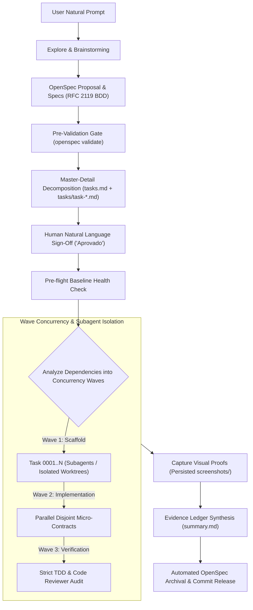

# Autonomous Spec-Driven Superpowers (ASDS)

[](https://github.com/Jaoguatirica/spec-driven-superpowers/actions)
[](https://opensource.org/licenses/MIT)
[](https://github.com/Fission-AI/openspec)
[](https://github.com/anthropics/superpowers)
[](https://nodejs.org)

> **The zero-defect, zero-command autonomous engineering standard for AI coding agents.**  
> Fusing **OpenSpec** (behavioral contracts & specifications) with **Superpowers** (TDD, micro-planning, worktree isolation, subagents, and double-review execution).

---

## ⚡ Why ASDS?

Traditional AI coding sessions ("vibe coding") suffer from structural flaws as projects scale:
- **Context Rot & Scope Creep:** The LLM drifts from requirements, hallucinating removed features or modifying unrelated files.
- **Flaky Deliveries:** Absence of strict TDD results in silent regressions and unverified claims.
- **Manual Overhead:** Users are forced to act as workflow micromanagers, typing repetitive slash commands (`/opsx-propose`, `/opsx-apply`, `/opsx-archive`).
- **Disposable Evidence:** Visual tests or screenshots are tossed into temporary caches instead of providing an auditable proof ledger.

**ASDS eliminates vibe coding entirely.** It establishes a self-governing protocol where the agent autonomously plans, specifies, verifies, parallelizes, audits, and archives changes with 100% mathematical and test-backed certainty.

---

## 🏛️ Core Principles

```
┌───────────────────────────────────────────────────────────────┐
│                    ASDS CORE PARADIGM                         │
├───────────────────────────────┬───────────────────────────────┤
│    OpenSpec Governs "WHAT"    │   Superpowers Governs "HOW"   │
│  - Behavioral Requirements    │  - Strict Test-Driven (TDD)   │
│  - Living Specifications      │  - Isolated Git Worktrees     │
│  - RFC 2119 BDD Scenarios     │  - Concurrent Subagent Waves  │
│  - Scope & Schema Validation  │  - Independent Double-Review  │
└───────────────────────────────┴───────────────────────────────┘
```

1. **OpenSpec Governs "What", Superpowers Governs "How":** Requirements are frozen in formal spec deltas before any code is written; technical execution adheres to strict TDD and worktree isolation.
2. **Zero-Command Autonomous Orchestration:** The agent leads from conception to archival. It never prompts the user to run manual slash commands. Human authorization is given via natural language (e.g., *"aprovado"*, *"pode prosseguir"*).
3. **Pre-flight Baseline Health Check:** Project test suites run before starting any task to detect legacy anomalies, preventing out-of-scope token waste.
4. **Master-Detail Task Architecture (`tasks.md` + `tasks/task-*.md`):** A stable dependency index links to atomic micro-contracts with rigid file boundaries.
5. **Native Parallelism & Workspace Isolation:** Disjoint tasks run concurrently via subagents in isolated workspaces (`Workspace: share` / worktrees) to avoid file-locking and cache collisions.
6. **Strict TDD & Evidence Ledger:** Every change requires Red-Green-Refactor. All visual UI proofs (`screenshots/`) and test outputs are permanently committed alongside code into a consolidated Evidence Ledger (`summary.md`).

---

## 🔄 Autonomous Lifecycle Workflow



---

## 📋 Master-Detail Task Architecture

Rather than a monolithic markdown checklist that causes merge conflicts and context overflow, ASDS enforces a **Master-Detail** model:

### 1. Master Index (`tasks.md`)
Defines execution waves, dependency order, and real-time completion state:
```markdown
## Wave 1: Foundation & Scaffolding (Concurrent)
- [x] [Task 0001](tasks/task-0001.md): Scaffolding repository structure
- [x] [Task 0002](tasks/task-0002.md): Architectural documentation

## Wave 2: Core Implementation (Concurrent - Depends on Wave 1)
- [ ] [Task 0003](tasks/task-0003.md): Core state machine engine
- [ ] [Task 0004](tasks/task-0004.md): Network RPC client
```

### 2. Micro-Contracts (`tasks/task-0001.md`)
Every task has an atomic contract that constrains the agent:
```markdown
# Task 0001: Core state machine engine

## 1. Metadata & Dependencies
- Task ID: Task 0001
- Concurrency Wave: Wave 2
- Prerequisites: Task 0001, Task 0002

## 2. Rigid File Boundary
- Permitted for Write: src/engine/state-machine.ts
- Strictly Prohibited: Any files outside the permitted list.

## 3. Test-Driven Development Protocol
1. RED: Write failing unit test in tests/state-machine.test.ts
2. GREEN: Minimal production code to satisfy test.
3. REFACTOR: Optimize without breaking contract.

## 4. Empirical Verification Command
$ npm test -- -t "state-machine"

## 5. Definition of Done
- Verification exits with code 0.
- No files outside permitted boundary modified.
- Atomic commit created: feat(engine): [Task 0001] State machine implementation
```

---

## 📊 Empirical ROI Matrix

| Metric | Traditional "Vibe Coding" | ASDS Autonomous Standard | Real-World Impact |
| :--- | :--- | :--- | :--- |
| **Defect Rate** | 25% – 40% silent regressions | **< 1%** (zero-defect target) | Eliminates repetitive debugging loops |
| **Token Efficiency** | High waste (re-explaining scope) | **Optimized (-45% tokens)** | Focused subagent micro-contracts |
| **Delivery Speed** | Sequential & manual prompting | **3x – 5x faster** | Concurrency waves + subagent dispatch |
| **Human Fatigue** | High (must babysit CLI commands) | **Minimal (1-click sign-off)** | Agent orchestrates from spec to release |
| **Living Documentation** | Stale / Disconnected | **100% Synchronized** | OpenSpec deltas automatically merge |
| **Audit Trail** | Fleeting terminal history | **Permanent Evidence Ledger** | Commits + Tests + Screenshots persisted |

---

## 🚀 Quick Start (1-Click Global Installation)

Clone this repository and run the setup script for your platform:

### Windows (PowerShell)
```powershell
git clone https://github.com/Jaoguatirica/spec-driven-superpowers.git
cd spec-driven-superpowers
.\scripts\install.ps1
```

### Linux & macOS (Bash)
```bash
git clone https://github.com/Jaoguatirica/spec-driven-superpowers.git
cd spec-driven-superpowers
chmod +x ./scripts/install.sh
./scripts/install.sh
```

### What gets installed:
1. `@fission-ai/openspec` CLI (global npm package).
2. Global skills directory linked to `~/.gemini/config/skills/` and `~/.agents/skills/`.
3. 21+ battle-tested skills (OpenSpec lifecycle, Superpowers TDD, Subagent dispatchers).
4. Universal governance rule `rules/AGENTS.md` injected automatically into every agent session.
5. `superpowers-bridge` custom OpenSpec workflow schema.

---

## 🛠️ Verification & Testing

Run the automated test suite locally:

```bash
npm test
```

This verifies:
- YAML frontmatter integrity across all 21+ packaged skills.
- Universal `AGENTS.md` rule directives and invariants.
- `superpowers-bridge` OpenSpec schema and templates.
- Cross-platform installer existence.

---

## 👤 Author & Governance

- **Author:** João Manoel ([@Jaoguatirica](https://github.com/Jaoguatirica))
- **Standard:** Autonomous Spec-Driven Superpowers (ASDS) v1.0
- **License:** [MIT](LICENSE)
