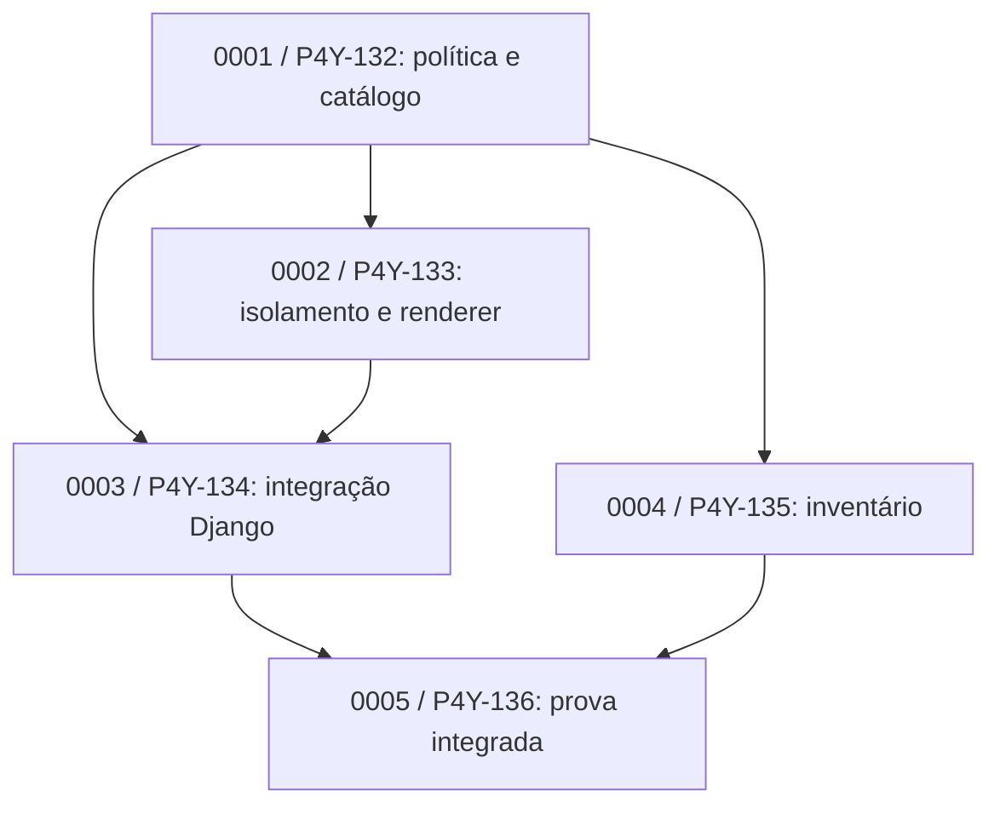

# Observação de campo — P4Y-131 / explorador de telas

Sessão observada: `01a0fd50-1610-7d72-8710-7475800654e7`.
Projeto observado: `/home/marcelo-karval/Backup/Projetos/prop4you/prop4you-inertia`.
Observação autorizada pelo proprietário, sem intervenção na sessão, no código do
projeto ou no Plane. Este documento pertence ao ASDS e não constitui outro plano
de execução para o Prop4You. Horários abaixo em UTC.

## Método e limites

Cruzar mensagens públicas/chamadas e resultados de ferramentas da sessão indicada,
artefatos específicos de `openspec/changes/dev-screen-explorer/` e readback Plane
via MCP governado. Não usar raciocínio privado, não contactar o executor/revisores,
não despachar agentes e não corrigir desvios durante a observação. Distinguir
registro histórico, estado atual, inferência e comportamento ainda não observado.
A API de thread retornou `notLoaded`/`interrupted`, mas o arquivo da sessão continuou
crescendo: esse status isolado não prova que a execução parou.

## Linha de base observada

- 15:51:37: pedido original de pesquisa/solução para exploração de telas Django/Inertia.
- 20:05:47: usuário autoriza criar plano/tasks e iniciar implementação.
- 20:06:01: sessão lê skills globais Accelerate, ASDS e Plane.
- 20:06:10: pergunta autorização específica para criar OpenSpec no projeto.
- 20:06:34: resposta humana autoriza a criação.
- 20:07:33: criação do parent P4Y-131; criação dos cinco filhos depois.
- 20:10:08: readback comprova parent real dos filhos, assignee e labels.
- 20:12:20–20:13:36: criação de proposta/design/specs/índice e microcontratos.
- 20:13:37–20:13:39: parent P4Y-131 e primeira tarefa P4Y-132 em In Progress.
- 20:15:11: escrita inicial dos testes da primeira tarefa; tentativas de execução
  de pytest observadas em seguida. Nenhum resultado de entrega inferido disso.

Readback inicial independente: P4Y-131/P4Y-132 em In Progress; P4Y-133–136 em Backlog.
Todos os cinco filhos têm parent `a30d0e24-365b-4d2a-9ff0-e1c9b6842ee8` confirmado.
Nenhum spawn de subagente confirmado neste primeiro recorte. Criação de subtasks
no tracker é um evento diferente de criação de sessões de execução.

## DAG declarado no design observado

O design fixa orçamento de implementação em um root devido ao checkout
compartilhado e dirty. Declara revisão independente somente leitura. A existência
dessas arestas no documento não comprova relações de bloqueio no Plane nem uso
do novo scheduler/journal ASDS.

## Primeiros achados e hipóteses a acompanhar

1. **Seleção do tracker tem proveniência local.** AGENTS.md do Prop4You define Plane
   como autoridade e proíbe Linear nesse projeto. Não atribuir essa escolha a um
   adaptador Plane já implementado no núcleo ASDS.
2. **Ativação respeitou autorização.** Pergunta e resposta explícitas precederam
   criação do OpenSpec. Verificar continuidade sem repetir autorizações no restante.
3. **Hierarquia e execução são dimensões distintas.** Parent/filhos estão provados;
   bloqueios causais no provider ainda não. Medir divergência entre DAG documental,
   prontidão local e estado do tracker.
4. **Decisão material ainda aberta.** Task 0002 é `implementation`, mas declara
   decisão de isolamento frame/rede em `openDecisions`. Observar se é resolvida e
   o contrato revisto antes dos writes, ou se investigação/implementação se misturam.
   Não classificar trabalho futuro como violação já ocorrida.
5. **Pilha disponível não implica núcleo executado.** Verificar quais referências,
   validadores, perfil, journal e pacotes realmente são usados; registrar qualquer
   coordenação manual sem presumir automação.
6. **Qualificação e fechamento.** Acompanhar teste negativo antes do código,
   baseline/dirty scope, candidato congelado, revisão independente, correções,
   integração, evidência real de navegador e reconciliação entre index/Plane.

## Estado no recorte inicial

Em andamento naquele recorte. O objetivo é acompanhar esta execução até seu retorno e reconciliar
pendências, sem transformar o primeiro sucesso ou bloqueio numa conclusão universal.

## Segundo recorte — 20:17–20:20 UTC

- 20:17:03: implementação da política/catálogo após testes RED com ausência do módulo.
  Antes do RED útil houve falha de configuração Django; não contar essa falha de
  ambiente como comprovação do teste de comportamento.
- 20:17:36: chamada `spawn_agent`, tarefa `/root/review_dev_explorer_foundation`,
  confirmada por retorno da ferramenta. Modelo efetivo e contexto limpo não estão
  comprovados pelo nome do papel; o conteúdo do despacho não está legível neste
  transporte. Não tentar reconstruir mensagem privada ou inferir seu conteúdo.
- 20:17:58: retorno de pytest: 47 passed. Django check passou; verificações de
  migrações sem apply retornaram sucesso em seguida. São resultados da primeira
  fatia, não comprovação do explorador renderizando páginas.
- 20:18:10 e 20:19:41: formatação/imports mudam o candidato após o spawn do revisor.
  Há mensagens de atualização ao revisor, mas seus conteúdos não são observáveis
  aqui. Acompanhar vinculação do parecer à identidade final, sem presumir erro.
- 20:18:53: root executa validador Python ad hoc: cinco microcontratos, nove cenários,
  índice coberto e DAG acíclico. O próprio resultado diz que não é o validador
  oficial OpenSpec/ASDS. Isso sugere investigar descoberta do toolkit/CLI e
  distinção entre validação de planejamento e prontidão para execução.

O coletor local de eventos registra ordinais/timestamps, nomes de ferramentas e
hashes de chamadas em `p4y-131-2026-10-02-events.jsonl`; não copia raciocínio privado,
conteúdo cifrado de despachos ou logs brutos. Sinais lexicais de resultados são
apenas pistas de inspeção, não classificação automática de sucesso/falha.

## Terceiro recorte — prontidão parcial e acesso às ferramentas

Uma leitura independente com `validateChange` do ASDS, sem executar comandos do
projeto, retornou exatamente:

- `0002: readiness unresolved or undeclared material decisions`
- `0003: readiness unresolved or undeclared material decisions`

A task 0001 está sem dependências e sem decisões abertas; 0004 é investigação,
com dependência de 0001; 0005 é operação. Nenhuma das cinco declara o metadado
opt-in `orchestration`. A sessão observa explicitamente que 0002/0003 não estão
prontas; não há evidência de que as tenha executado neste recorte.

**Hipótese para o ASDS:** separar validação de inventário/plano da admissão da
fronteira executável. Uma tarefa futura incompleta não deveria, por si só, invalidar
uma tarefa pronta e independente. A política continua bloqueando execução da
própria tarefa incompleta e de seus consumidores. Este caso também pede transformar
uma decisão de isolamento em investigação delimitada, se ela impedir o renderer.
Ainda não foi implementada qualquer correção em consequência desta observação.

**Hipótese de descoberta:** as referências instaladas indicam uso do toolkit no
checkout, mas a sessão relata que os validadores oficiais não estão no PATH e
escreve sua própria aproximação. Precisamos de um modo explícito de descobrir
capacidade/localização/versão do toolkit, sem inventar outro runtime ou tornar
instalação global obrigatória. Fallback manual deve dizer quais garantias perdeu.

Às 20:22:49 a sessão invocou commit com escopo explícito para P4Y-132. O retorno do
commit e o fechamento Plane ainda precisam de reconciliação; chamada não é êxito.

## Fechamento do primeiro turno observado — 20:24:56 UTC

Retorno da sessão: plano/tasks criados e implementação iniciada; não declara o
explorador entregue. Confirmação independente posterior por MCP e Git:

| Item | Estado confirmado |
| --- | --- |
| P4Y-131 | In Progress, parent aberto |
| P4Y-132 | Review / QA, sem completed_at |
| P4Y-133–136 | Backlog, parent real preservado |
| Índice OpenSpec | Cinco checkboxes abertos |
| Commit | d011eb2317a19d5ba90f1e014083fa8953d3a29f, 17 arquivos, referência P4Y-132 |
| Produto utilizável | Não entregue neste turno; não existe rota/painel exposto conforme relatório |

A sessão criou comentário AI Review e fez readback após as mutações. O comentário
é evidência de registro, não substitui revisão do conteúdo. A evidência de 47 testes
é o retorno das ferramentas observado no transcript; este observador não executou
os testes do projeto nem qualificou o produto no navegador.

## Recomendações provisórias para evolução do ASDS

| Prioridade | Aprendizado | Experimento/critério posterior |
| --- | --- | --- |
| Alta | Descoberta de toolkit ausente apesar de skills presentes | Resolver localização/versão/capacidade por mecanismo oficial; obter a mesma validação em entrada direta e por skill, sem segunda instalação |
| Alta | Plano completo e fronteira pronta são validações diferentes | Um DAG válido com tarefa futura bloqueada deve permitir a tarefa independente pronta, sem permitir a bloqueada ou seus consumidores |
| Alta | Estado de QA precisa de motivo e dono do bloqueio | Distinguir revisão de código concluída, validação de artefatos pendente e integração não comprovada; mapear isso ao tracker sem inferir Done |
| Média | Revisão deve receber candidato estabilizado | Aplicar formatadores/checagens antes do congelamento; toda mudança posterior reabre explicitamente a revisão do delta |
| Média | Comando real diverge do contrato textual | Registrar ambiente não secreto e opções efetivamente necessárias, sem relatar falha de configuração como RED útil ou substituir comandos silenciosamente |
| Média | Hierarquia não é DAG | Confirmar se bloqueios reais estão modelados no provider ou só nos documentos; testar round-trip sem alterar parent/child |
| Média | Spawn não prova contexto limpo ou modelo efetivo | Pedir prova portável de contexto/capacidades no adaptador futuro; preservar desconhecido quando o transporte não expõe esses dados |

**Conclusão delimitada:** a combinação de skills e regras locais conduziu uma
primeira fatia, gerou rastreabilidade e preservou a entrega parcial. Não é prova de
integração completa do novo núcleo de orquestração nem da conclusão da feature.
A primeira janela terminou no retorno do turno, não no fechamento do parent.

## Continuidade da coleta

Uma coleta passiva local de metadados acompanha eventuais novos turnos desta mesma
sessão por até duas horas adicionais. Ela apenas lê o transcript indicado e grava
neste diretório; não envia mensagens, não opera o Plane nem executa código do
Prop4You. A análise acima é do recorte explicitamente reconciliado; novos eventos
não atualizam automaticamente conclusões ou comprovam entrega. O coletor encerra
no limite e registra esse fato. Não é um serviço instalado nem monitor permanente.

## Revisão do diagnóstico — encerramento prematuro do coordenador

Recebido o handoff da sessão Accelerate `01a0f874-589a-7081-82d9-a3815921ff3e`
e conferidas diretamente as mensagens públicas posteriores no transcript original.
Referência complementar: `accelerate/docs/reviews/2026-10-02-premature-stop-insights.md`.
Esta atualização registra achados; não autoriza retomar o Prop4You ou alterar o ASDS.

| Horário UTC / ordinal | Fato conferido |
| --- | --- |
| 22:11:56 / 419 | Pedido humano de revalidação/status |
| 22:13:32 / 456 | Agente confirma ausência de avanço; mesma fundação, parent In Progress e tarefas futuras Backlog |
| 22:37:40 / 463 | Primeira proibição humana explícita de iniciar ações nesse recorte |
| 22:37:56 / 466 | Agente confirma que nenhum executor trabalha em P4Y-133–136 e reconhece parada após a fundação |
| 22:38:39 / 476 | Reconhece ausência de bloqueio técnico comprovado para todo o desenvolvimento e a decisão de encerrar o turno |
| 22:39:44 / 496 | Reconhece que explicar a limitação da janela não justificava a decisão anterior de parar |

**Correção da conclusão anterior:** relatar honestamente uma entrega parcial foi
positivo, mas não bastava para avaliar a condução. Houve encerramento prematuro do
coordenador com trabalho autorizado restante. A primeira análise registrou o retorno
parcial sem destacar essa falha de continuidade com a clareza necessária.

O CLI ausente bloqueava uma validação específica; não foi demonstrado bloqueio de
todas as ações restantes. Decisões de isolamento exigiam investigação delimitada,
não eram prova automática de necessidade de devolver o turno. A admissão posterior
do agente corrobora a sequência observável; não é sua única evidência.

A ordem de não executar, às 22:37:40, é posterior à parada de 20:24:56 e não a
justifica retroativamente. A partir dessa ordem, não retomar era correto. Não
atribuir a falha a uma versão específica das skills: não foi reconstruída toda a
identidade dos conteúdos efetivos de cada turno.

### Backlog de insights — recomendações ainda não implementadas

- **Continuidade depois de cada entrega:** reavaliar objetivo restante, aceite,
  dependências e autorizações; executar a próxima ação pronta, incluindo investigação
  necessária dentro do escopo. Concluir uma task não conclui o objetivo.
- **Alcance do bloqueio:** registrar prova/ação afetada, dependentes, responsável e
  condição de saída; continuar ações independentes sem inventar validação.
- **Atividade real:** distinguir assignee, coordenador, executor ativo, espera por
  resultado, bloqueio específico, pausa humana e objetivo aceito. Um parent In Progress
  ou um coletor de observação não constitui executor de implementação.
- **Pedidos de status:** responder preservando o objetivo autorizado; não substituir
  automaticamente implementação por um novo objetivo de apenas relatar. Pausa humana
  explícita permanece distinta e deve ser respeitada.
- **Fronteira Accelerate/ASDS:** após aceite, ASDS mantém a condução. Accelerate leva
  objetivo/limites no handoff; não adicionar outro supervisor ou aprovação de encerramento.
- **Persistência sem serviço artificial:** continuidade dentro do turno não exige
  daemon. Continuidade após encerrá-lo só existe se houver mecanismo real do harness;
  não prometer background nem instalar runtime adicional para encobrir a parada.

Cenários a qualificar futuramente: próxima task pronta após revisão positiva;
validador ausente com trabalho independente; tracker In Progress sem executor;
pergunta de status durante execução; ordem explícita de pausa; e todas as próximas
ações realmente bloqueadas. **Não executados nesta observação.**

Estado da coleta nesta atualização: o coletor Prop4You encerrou normalmente ao
atingir duas horas, no ordinal 459. As mensagens 463–496 acima foram lidas depois,
diretamente da fonte; não alegar que estiveram na janela automática original.
O coletor Agrelli ainda estava ativo na conferência, com cerca de onze minutos
restantes na própria janela. Nenhum coletor foi renovado por este handoff.

## Dependências — descoberta antes de instalação assistida

Complemento recebido do Accelerate e conferido nesta sessão, sem instalação ou
alteração de produto. Na shell examinada, com cwd no Prop4You, `command -v openspec`
não encontrou executável. O caminho já conhecido e documentado
`/home/marcelo-karval/Backup/Projetos/spec-driven-superpowers/node_modules/.bin/openspec --version`
retornou **1.14.0**. Esta é prova de disponibilidade atual por caminho explícito,
não reconstrução do ambiente histórico nem validação de todas as operações.

O README ASDS orienta usar o executável fixado no checkout, enquanto as skills
OpenSpec declaram dependência do CLI e mostram comandos pelo nome `openspec`.
A ativação pergunta sobre o estado do projeto; falta um procedimento compartilhado
de descoberta/preparação da ferramenta. Assim, registrar “CLI fora do PATH” em vez
de generalizar para “CLI inexistente”. Esta evidência reforça o gap de descoberta,
sem apagar a pendência histórica da validação nem justificar a parada global.

### Recomendação adicional ao backlog, ainda não implementada

1. Uma verificação de pré-requisitos no ASDS, condicionada à operação: identidade,
   finalidade, obrigatoriedade, origem/caminho, runtime, versão, capacidade, evidência
   e estado observado. Skill carregada, CLI executável e projeto inicializado são
   fatos separados. Versão correta sozinha não prova capacidade do comando requerido.
2. Consultar PATH efetivo e instalações compatíveis conhecidas/documentadas antes
   de oferecer instalação. Não varrer HOME, baixar via npx, criar wrapper/symlink
   nem duplicar runtime para remediar uma falha de descoberta.
3. Quando faltar a dependência, explicar impacto e oferecer orientação/instalação
   assistida: método oficial atualizado, compatibilidade requerida, comando,
   destino e alterações previstas. Reutilizar autorização anterior aplicável;
   pedir somente decisão ausente. Preservar recusa e opção de instalação pelo usuário.
4. Separar autorização de instalar a ferramenta, inicializar/configurar o projeto
   e executar o trabalho. Diagnóstico não autoriza nenhuma dessas mutações.
   A política do proprietário continua governando instalações e eventuais exceções.
5. Depois de uma instalação autorizada, verificar executável, versão e capacidade
   efetivos, caminhos e limpeza pertinentes. Resolver divergências entre versão
   fixada pelo ASDS e upstream de forma explícita, sem atualização/downgrade implícitos.
6. Bloquear somente ações/provas dependentes; continuar trabalho independente e
   retomar o plano existente quando o pré-requisito for resolvido. Revalidar a
   observação após mudanças relevantes, não executar preflight integral a cada mensagem.
7. Accelerate prepara entrada e verifica disponibilidade do ASDS; não duplicar
   esse preflight. Superpowers é um conjunto de skills nesta composição, não uma
   CLI universal. Cada ferramenta declara suas necessidades; o harness executa
   sob as permissões efetivas.

Casos de avaliação futuros: CLI fora do PATH; CLI realmente ausente; runtime ou
capacidade incompatível; múltiplos executáveis; execução negada; instalação recusada
ou falha; autorização prévia; projeto ausente/configuração inválida; dependência
opcional; e retomada com trabalho independente. Nenhum desses cenários foi tratado
como executado por este registro; apenas o diagnóstico de PATH/versão acima foi
verificado agora. Não houve instalação nem mudança de skills, código ou release.
