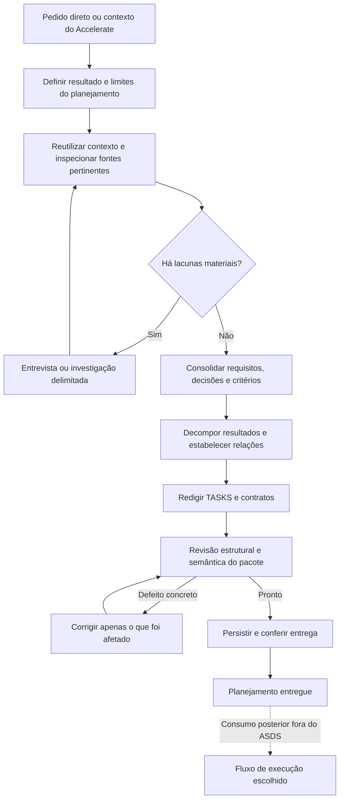

# ASDS como produtor de planejamento: pesquisa de fundamentos

## 1. Conclusão

**O ASDS atual não está alinhado à finalidade declarada pelo proprietário.** Não é
apenas falta de um hook ou erro de um modelo menor. As autoridades ativas dos dois
projetos definem ASDS como coordenador de desenvolvimento até integração de código.
Há bons componentes de planejamento, mas o produto final está definido como entrega
implementada. O esforço de engenharia seguiu essa definição errada.

A recomendação é **realinhar finalidade, fronteiras, critérios de conclusão e contrato
de planejamento**, preservando componentes úteis. Não reconstruir tudo, não apagar
capacidades de execução úteis ao ecossistema e não adicionar um controlador maior
para compensar um contrato de produto incorreto.

A unidade de sucesso deve ser: objetivo compreendido → requisitos e decisões
suficientes → decomposição revisada → TASKS e contratos coerentes → persistência
verificada → entrega no destino escolhido. A implementação posterior é consumidora.
Planejar inclui ler, perguntar, comparar opções, revisar e escrever os artefatos;
isso não deve ser confundido com implementar o software que as tasks descrevem.

O histórico orientou a localização das fontes; a conclusão usa o código e os arquivos
atuais. Esta é uma pesquisa, não alteração de escopo aplicada silenciosamente ao runtime.

## 2. Evidência central: a finalidade errada é normativa

| Fonte atual | O que determina | Consequência |
|---|---|---|
| `openspec/specs/asds-core/spec.md:5,9,16-19` | Framework de engenharia ponta a ponta; transição imediata para TDD após autorização | Produzir o plano é passagem para implementar |
| `skills/spec-driven-superpowers/SKILL.md:55-68` | Executar tarefas, revisar entregas, integrar, reconciliar receipts e continuar até o resultado original | Não há parada própria de planejamento entregue |
| `schemas/superpowers-bridge/schema.yaml:61-94` | Índice de conclusão por integração; summary de execução; apply orientado a TDD | O formato leva progresso de implementação para o centro |
| `schemas/superpowers-bridge/templates/task-template.md:46-51` | Definition of done exige código verificado e integrado | Qualidade do documento e conclusão da tarefa futura se confundem |
| `lib/orchestration.mjs:218-299` | Transições executing/delivered/reviewed/integrating/accepted | Estado rico de execução; não de revisão do planejamento |
| Accelerate `core/asds-integration.md:5-8` e `SKILL.md:21` | ASDS assume especificação, planejamento, execução, integração e encerramento | O chamador encaminha responsabilidade incompatível com a intenção real |

**Não basta corrigir a descrição da skill.** A mesma definição aparece em spec,
protocolo, schema, templates, adaptação das skills, retorno, docs e expectativas de teste.
Também não é apenas um problema de versão instalada: as skills globais de entrada
ASDS, Accelerate e writing-plans inspecionadas têm os mesmos bytes das fontes atuais
([source-snapshot.json](source-snapshot.json)). Isso não certifica todos os exports.

## 3. Caminho atual, fase por fase

| Fase/step atual | Fontes principais | O que existe | Avaliação diante do produto de planejamento |
|---|---|---|---|
| Entrada e classificação | Accelerate SKILL; core/entry.py; core/routing.py | Conversa/direct/asds; contexto de sete campos; preservação de decisões | Aproveitar. Deve reconhecer que o produto pedido pode ser um plano, mesmo pequeno |
| Recepção/aceite | ASDS intake.md; lib/handoff.mjs | received/accepted/needs-reassessment, lacunas e continuidade | Aproveitar. Aceite do planejamento precisa ter fim próprio |
| Ativação/armazenamento | activation.md; lib/install.mjs | Disponibilidade global separada de root local; autorização e recusa | Aproveitar. Recusa de OpenSpec não pode reduzir a qualidade obrigatória das tasks |
| Entendimento incremental | planning.md:3-25 | Inspeção, lacunas materiais, decisões e consequências | Bom fundamento; faltam critérios de saída observáveis ligados ao pacote entregue |
| Brainstorming | Superpowers brainstorming/SKILL.md | Exploração, alternativas, design; ASDS mode evita segundo plano | Útil quando necessário; não deve impor cerimônia a todo pedido |
| Proposal | schema.yaml:5-19; template proposal | Por quê, mudanças, capacidades, impacto e entendimento | Apoio à entrega, não produto final substituto de TASKS |
| Specs | schema.yaml:21-31; spec template | Requisitos e cenários | Fonte de rastreabilidade. Presença de cenário não prova cobertura de todos os critérios |
| Design | schema.yaml:33-40; design template | Decisões, interfaces, segurança, verificação | Deve resolver escolhas que mudam tarefas; specs/design hoje são irmãos no DAG de artefatos |
| Microcontratos | schema.yaml:42-59; planning.md:65-128 | Outcome/Inputs/Acceptance/Verification/DoD, boundaries, escopos e cenários | Centro aproveitável, mas pouco protegido semanticamente |
| Índice | schema.yaml:61-71; tasks template | Bijeção entre índice e arquivos; waves ilustrativas | Hoje é sobretudo checklist de implementação; falta mapa do planejamento entregue |
| Validação | lib/contracts.mjs; lib/validation.mjs | YAML, caminhos, IDs, ciclos, cenários, seções e receipts | Boa estrutura; não equivale a revisão da qualidade do plano |
| Waves | orchestration.md:57-95; readyWave | Elegibilidade dinâmica, modelos, reservas, revisões, recursos | Execução posterior; planejamento só precisa declarar dependências e paralelismo possível |
| Dispatch/execução | host-bridge.mjs; orchestration.mjs | Preparar sessão, reservar e iniciar; TDD e escopo | Fora da finalidade ASDS definida pelo usuário |
| Revisão/integração | protocol.md:34-49; orchestration.md:97-127 | Revisão de candidato e de código integrado, decisão forense | Não substitui revisão de planejamento; deve sair da obrigação do planejador |
| Refinamento/retomada | decomposition.mjs; plan-projection.mjs; operational-continuity.md | Divisão e invalidação de dependentes, conservação de histórico | Aproveitar princípios; separar revisão do plano do andamento de execução |
| Retorno | handoff.mjs:55-69; schema summary | outcome/evidence/remainingWork/limitations; completed genérico | Falta entrega de planejamento com integridade e revisão próprias |
| Plane/Linear/UI | integrations.md | Arquitetura proposta, sem connector implementado | Não contar como produto disponível; projeção deve preservar o plano |

Não há um processo autônomo executando essa tabela inteira. A skill orienta um agente;
o toolkit oferece bibliotecas/CLI opcionais. Ler a skill não prova que cada etapa foi
aplicada; usar uma função não prova o fluxo inteiro. As fases de interview/onboarding/
briefing não aparecem como máquinas de estado distintas no núcleo inspecionado:
parte de seu propósito está distribuída por intake/understanding/brainstorming.
Não é necessário criar três subsistemas novos para dar nome a essas atividades.

## 4. OpenSpec e Superpowers: contribuição real e ligação incompleta

### OpenSpec

O schema customizado `superpowers-bridge` declara proposta → specs/design →
microcontratos → índice. Isso é uma base útil. Os testes de OpenSpec verificam que
um fixture com esse schema expõe os contratos e o progresso pelo CLI
(`tests/openspec.test.js:30-72`). Não medem qualidade de documentos gerados por agente.

Há uma condição importante: **schema instalado não significa schema selecionado**.
O repositório usa `spec-driven`; o instalador seleciona `superpowers-bridge` apenas
no caminho explícito de ativação de projeto. `openspec-propose` manda preservar o
schema configurado por padrão. Seu ASDS mode menciona microcontratos, mas não define
completamente a reconciliação quando o schema efetivo não possui esse artefato.
Isso cria um caminho de qualidade variável: um agente pode seguir o fluxo normal
OpenSpec e achar que `tasks.md` basta. A correção é garantir o contrato de saída ASDS
independentemente do adaptador/schema escolhido, preservando a configuração do projeto.
Não se deve sobrescrever config ou inicializar root para forçar essa garantia.

Outra tensão explícita: `openspec-propose/SKILL.md:13-19` adiciona um ASDS mode que
permite continuar para implementação com autorização anterior; abaixo, o fluxo
standalone é planejamento e parada. A sobreposição é intencional no código atual,
mas contradiz a finalidade agora esclarecida. O modo ASDS deveria reforçar a entrega
de planejamento, não remover sua fronteira.

### Superpowers

`brainstorming` fornece boas perguntas e exploração de design. `writing-plans`
fornece tarefas pequenas, contexto para quem não participou da conversa, comandos,
resultados esperados e revisão contra a spec. Esses são recursos centrais, não
apenas acessórios de um executor TDD.

Contudo:

- ASDS menciona writing-plans, mas não oferece prova obrigatória de sua aplicação
  ou mecanismo equivalente antes da entrega.
- Há `writing-plans/plan-document-reviewer-prompt.md` com completude, alinhamento,
  decomposição e viabilidade. A busca nas superfícies de núcleo/templates/testes
  inspecionadas não encontrou uma chamada/referência que o transforme em gate
  sistemático de entrega. Não é prova de que nenhum agente jamais o usa.
- A self-review de writing-plans termina com “No need to re-review — just fix and
  move on” (`:131-141`). Portanto, não existe ali o loop de reparo e revalidação que
  imaginávamos garantido pela pilha.
- A regra standalone de código completo em cada passo e ações de 2–5 minutos
  (`writing-plans:45-53,115-129`) não deve ser importada mecanicamente. Isso pode
  transformar planejamento em implementação antecipada e fragmentação por passos
  de ferramenta. Uma task deve conter uma entrega independente; seus steps não
  precisam virar issues distintas de “rodar teste” e “fazer commit”.
- Os blocos ASDS mode preservam caminhos e autorizações, mas deixam um corpo grande
  de instruções standalone com gates, commits e handoffs diferentes. Reduzir a
  ambiguidade desses modos importa mais que adicionar mais instruções ao final.

A união valiosa é: OpenSpec organiza requisitos/decisões/rastreabilidade; Superpowers
ajuda a formular tarefas e revisá-las. **Não basta distribuir os dois conjuntos de
skills e chamar isso de integração comprovada.**

## 5. Achados verificáveis no núcleo

### P0 — Não existe produto final de planejamento definido de ponta a ponta

`createReturn` aceita completed com referências textuais de evidência; não verifica
índice, contratos, revisão semântica, revisão de plano ou projeção no destino. Isso
é coerente com sua função de contrato de dados, mas deixa ausente o gate de produto.
Nossa sondagem retorna completed com `UNVERIFIED-TASKS.md`, sem tentar abrir arquivo.
Não é falha de autenticação: é demonstração do limite da função.

Precisamos distinguir: **planejamento entregue**, **planejamento parcial/bloqueado**,
e **tarefas futuras implementadas**. Um pacote entregue pode ter todas as checkboxes
de implementação desmarcadas. Não se deve exigir receipts de código para concluir
a encomenda de planejamento, nem marcar tarefas futuras como executadas para fazê-lo.

### P0 — Hierarquia desejada é proibida, não apenas ausente no template

`lib/decomposition.mjs:12` rejeita pacote com pai e tarefa com avô. `refine` cria
irmãs, não filhas (`:36-59`). Há teste positivo de crescer 20 → 50 folhas **sem nesting**
(`tests/decomposition.test.js:88`). Isso conserva tamanho da lista, mas não representa
mães/filhas/netas/bisnetas. Nossa sondagem confirma a rejeição.

Precisamos de duas relações separadas: **pertence a** (árvore de decomposição) e
**depende de** (DAG de precedência). Um vínculo de composição não é automaticamente
uma dependência de execução em sentido pai → filho. Agregados resumem resultados;
folhas têm fronteiras de entrega. Suportar profundidade não significa impor níveis
artificiais a uma task simples. Waves são uma visão derivada, não uma terceira
hierarquia nem outra autoridade de planejamento.

### P1 — Prontidão estrutural não protege qualidade semântica

`validateReadiness` verifica kind, decisões vazias e cinco seções não vazias sem
TODO/TBD. `boundaryErrors` verifica strings e `review.verdict == ready`. Em uma
sondagem, uma task ampla de salvar/listar/abrir/excluir, com “x” em todas as seções,
passa nesses checks. O código declara honestamente que o sentido depende do revisor.
O problema do produto é não ter revisão semântica verificável e condição de entrega
que consuma essa revisão.

Adicionar regex de verbos ou limite arbitrário de tamanho não resolve: uma frase
curta pode conter uma entrega ampla; uma task longa pode ser perfeitamente delimitada.

### P1 — Planejamento mistura-se com escolha de executor

`compilePlan` exige perfil com tiers/modelos; CLI `dag` depende de journal/plano
compilado (`scripts/orchestrate.mjs:22-38`). É uma opção de coordenação, não requisito
universal para escrever Markdown, mas acopla a representação determinística disponível
à operação de execução. O DAG de planejamento deveria poder ser validado e apresentado
sem escolher modelo, abrir sessão, reservar worktree ou obter prova de integração.

A sondagem mostra que duas tasks escrevendo o mesmo arquivo são válidas, e a seleção
de execução apenas as torna sequenciais. Portanto, compartilhar arquivo não obriga
fundir seus contratos. Não confundir fronteira de entrega com exclusão de recurso.

### P1 — Persistência protegida existe para o journal, não para o pacote final

`orchestration-store.mjs:27-58` publica JSON preparado e atualiza por rename com lock.
Esse mecanismo protege o estado local de coordenação. Ele não torna transacional
uma sequência manual de edições em TASKS/specs/contratos. CLI decompose/refine confere
que as fontes **já editadas** correspondem ao plano (`scripts/orchestrate.mjs:47-49`).
Não há ali publicação integral do pacote de planejamento.

O objetivo futuro é conservar a versão anterior até a nova estar consistente e
verificar o readback. Atomicidade de um arquivo não é atomicidade de N arquivos ou
N issues remotas. O mecanismo concreto deve respeitar o layout autorizado e não
criar backups/instalações paralelas automaticamente. A pesquisa não instala nem
implementa esse mecanismo.

### P1 — Fallback sem OpenSpec preserva autorização, mas não define saída equivalente

A recusa continua o trabalho (`activation.md:37`); a projeção de plano existente
é explícita e vinculada a hashes. Isso é útil. Porém, a saída canônica validada por
`loadTasks` continua exigindo proposal/design/specs/tasks. Falta especificar como um
planejamento novo sem OpenSpec entrega índice e contratos igualmente bons, sem um
plano duplicado e sem precisar de um schema que o usuário recusou.

### P1 — Cobertura dos testes é forte em mecanismo e fraca na finalidade

O catálogo ASDS possui 16 evals e ainda declara `prepared_not_run`. Alguns novos
cenários tratam decomposição, mas prompts/expectativas continuam em torno de execute,
dispatch e aceites. O teste de catálogo confere campos/arquivos e inclusive fixa a
string prepared_not_run (`tests/index.test.js:31-39`). Testes de decomposição validam
transformações em dados fornecidos; não provam que o agente percebeu a necessidade
de transformar um pedido em contratos bons.

A bateria Luna anterior é evidência auxiliar, não substitui os testes de produto:
misturou execução, pedidos sem obrigação de contratos e prazo curto; um caso foi
contaminado. O principal erro de avaliação foi não exigir e revisar um pacote completo
de planejamento como saída de cada caso de planejamento.

## 6. Accelerate: preservar a entrada, corrigir a responsabilidade transferida

Auditoria independente no checkout Accelerate confirmou que a atribuição de execução
ao ASDS está no contrato ativo e nas projeções Codex/OpenCode/OpenHands/global runtime,
não apenas em arquivos antigos. Referências: `AGENTS.md:8-12`, `SKILL.md:16-23`,
`core/asds-integration.md:5-8`, `global-runtime/accelerate/SKILL.md:25-27`,
`adapters/runtime/codex/global-bootstrap-orchestration.fragment.md:4` e
`adapters/runtime/opencode/accelerate-plugin.js:15-18`.

O classificador é pequeno e aproveitável. Ele recebe observações estruturadas, não
faz inferência do prompt por si só. O handoff transmite objective/project/scope/
constraints/risks/references/authorizations. “Planejamento apenas” pode viajar nesses
campos hoje; não existe, porém, um tipo formal de produto que diferencie plano pronto
de software implementado. Acrescentar campos obrigatórios quebraria o v1, que rejeita
extras. Primeiro corrigir significado/ownership; uma evolução de protocolo, se
necessária, deve ser explícita e compatível por versão.

A continuidade `workflow_owner == asds` retorna continue_asds antes de reclassificar
(`core/entry.py:54-56`). É bom durante o planejamento; precisa terminar quando ele é
entregue. O pedido posterior “agora implemente” não pode perpetuar ASDS como executor
por inércia. O proprietário dessa execução posterior não está definido sob a nova
finalidade: não inventar um executor, ressuscitar Accelerate v0 ou colocar Plane
nesse papel. Plane recebe e representa trabalho; isso não o torna agente executor.

Também é necessário preservar o objetivo original do usuário: se pediu “implemente X”,
a entrega de um plano conclui a contribuição ASDS, não o pedido inteiro. O chamador
precisa receber essa distinção e escolher o fluxo posterior autorizado. Se pediu
“planeje X”, pode encerrar a encomenda com o pacote verificado.

O catálogo volumoso de Accelerate não é automaticamente um pipeline enorme. Há
aposentadoria explícita do controlador v0 (`core/README.md:11-14`) e separação de
91 suites ativas/11 historical-v0 em `tests/suites.json`. Skills de execução podem
continuar disponíveis como recursos opcionais do ecossistema, fora da finalidade ASDS.

### Hooks e gates reais

- Accelerate `adapters/runtime/codex/codex-hooks.json` contém `hooks: {}`. Seu teste
  confere formato/existência/strings, não aplicação semântica do planejamento.
- O plugin OpenCode injeta instruções (`accelerate-plugin.js:58-81`); não chama o
  classificador, executa ASDS ou verifica a qualidade das tasks.
- No ASDS, CLI/bibliotecas são opcionais; o instalador distribui skills e schema,
  não um hook universal de criação e aprovação de planos.

Portanto, não podemos prometer que um hook atual impede tarefa ruim. Também não é
razoável começar a correção criando um: sem definição de produto correta, ele apenas
forçaria com mais eficiência o fluxo errado.

O auditor executou 66 testes puros de entry/routing/authority com sucesso. Eles
confirmam contratos atuais, inclusive partes agora incompatíveis com a finalidade.
Não medem escrita de TASKS/contratos, seleção espontânea de skills ou projeção Plane.

## 7. Fluxo-alvo recomendado: fases condicionais, saída obrigatória

Este é um desenho proposto, não fluxo já implementado.

A volta de perguntas ou revisão tem condição de parada. Sem resposta material ou
sem evidência suficiente, devolver estado parcial/bloqueado com a lacuna e seu dono;
não girar indefinidamente. Uma nova ideia opcional vai para disposição separada, não
vira defeito retroativo do escopo aceito.

| Atividade possível | Quando usar | Produto/condição de saída |
|---|---|---|
| Intake/briefing | Sempre há algum contexto de entrada; aprofundar apenas o necessário | Objetivo, escopo, exclusões, destinatário e forma de entrega identificados |
| Onboarding | Falta contexto do projeto/domínio relevante | Fontes e convenções necessárias identificadas, sem varrer tudo |
| Interview | Uma resposta do usuário altera requisito, limite ou aceite | Decisão registrada com consequência; se pendente, dependentes identificados |
| Pesquisa/investigação | Fato verificável ainda impede planejar | Conclusão sustentada ou limitação precisa; não experimento sem fim |
| Brainstorming | Há abordagens/decisões de design realmente abertas | Opção e trade-offs suficientes para decompor |
| Especificação/design | Profundidade depende da mudança e do contexto recebido | Contrato comportamental coerente; pode reutilizar artefatos existentes |
| Decomposição | Obrigatória para toda encomenda ASDS de planejamento | Agregados e folhas com fronteiras defensáveis, sem teto artificial de quantidade |
| Dependências/waves | Ordenação sempre considerada; waves só se úteis | Relações justificadas e oportunidades de paralelismo, sem dispatch |
| Revisão do planejamento | Obrigatória; profundidade proporcional | Defeitos resolvidos e limites declarados; independente quando aplicável/disponível |
| Persistência/entrega | Obrigatória no destino autorizado | Índice e contratos completos, recuperáveis e conferidos no destino |

Essas atividades não exigem um documento adicional por fase. Consolidar nas fontes
existentes e nos artefatos finais. Reutilização de contexto pode satisfazer uma fase
sem repeti-la. “Não houve entrevista” é aceitável quando já há entendimento suficiente;
“não houve contratos finais” não satisfaz uma encomenda de planejamento pronto.

Uma investigação pode ser trabalho interno necessário para o próprio planejamento,
ou uma folha futura quando o objetivo solicitado é justamente planejar a investigação.
Não entregar uma task genérica “descobrir o que precisa ser feito” como substituta de
planejamento que o ASDS já poderia ter realizado com fontes disponíveis.

## 8. Contrato mínimo da entrega excelente

### TASKS: visão do todo

Deve permitir entender objetivo/limites, fontes normativas, revisão do plano,
hierarquia, IDs estáveis, relações de precedência, bloqueios e seus donos, decisões
pendentes, paralelismo recomendado e links para todos os contratos. Deve evidenciar
cobertura dos requisitos e critérios do pacote, inclusive composição do resultado.
Waves e ordem de exibição derivam das relações; renumerar visualmente não troca IDs.

O índice não é só uma lista de títulos nem precisa repetir todo conteúdo das folhas.
Seu estado de planejamento é distinto das checkboxes da futura implementação. Plano
entregue não implica task executada. A aceitação de planejamento de uma mãe significa
que seu recorte e a cobertura dos filhos foram revisados, não que o software existe.

### TASK individual: recebível sem reinventar o planejamento

Os critérios de conclusão da tarefa futura podem incluir testes e integração pelo
consumidor. Eles são conteúdo válido do contrato; o erro é exigir sua execução para
considerar o documento de planejamento entregue.

Uma folha precisa de: resultado observável; contexto e fontes necessários; alvo e
fronteira; inclusões/exclusões; entradas e pré-condições; saídas/contratos consumidos
por outras tasks; critérios positivos, negativos e preservações relevantes; plano de
verificação com resultado esperado; dependências e razão; riscos/decisões materiais;
relação com o requisito e com o agregado.

Steps internos orientam a entrega sem virar uma microissue para cada comando. Caminhos
exatos são valiosos quando conhecidos; o planejador deve distingui-los de caminhos
propostos, sem inventar fatos de um projeto inexistente. Código completo não é condição
universal de planejamento excelente. Detalhe deve eliminar ambiguidade relevante e
permitir execução, não escrever toda a implementação antecipadamente.

Revisão decisiva: **alguém que não participou da conversa consegue explicar o que vai
entregar, o que não vai alterar, do que precisa e como demonstrará aceite?** Se precisa
escolher regra de produto ou reconstruir requisito, falta planejamento. Liberdade sobre
um detalhe interno reversível que não muda contrato não é automaticamente uma lacuna.

### Exemplo conceitual de fronteira, não backlog criado

“Visões salvas” pode ser agregado. “Salvar visão”, “listar visões”, “abrir visão” e
“excluir visão” podem ser folhas ou subagregados conforme o projeto. Um contrato
compartilhado de persistência/identidade pode preceder seus consumidores. UI e domínio
não são obrigatoriamente a mesma task, nem precisam ser separados sempre.

A folha “abrir visão existente restaura o filtro de status” define entrada (ID e
visão existente), efeito observável, comportamento para ID ausente, preservação dos
pedidos, interface com quem fornece os registros e verificação correspondente. Isso
é muito mais delimitado que “implementar a camada de visões”. Compartilhar app.js
com outras folhas apenas pode exigir sequência de escrita.

### Local e Plane: duas representações do mesmo planejamento

O núcleo deve manter identidade e significado dos nós/relações. O adapter projeta
conteúdo e relações no destino autorizado. Não usa título como identidade, não gera
um segundo plano e não deixa tarefas remotas divergirem silenciosamente dos contratos.
A correspondência deve incluir pai/filhos, dependências, bloqueios, critérios, revisão
e referências. Não prometemos recursos específicos da API Plane sem uma análise de
capacidade posterior.

Se um destino não representar um nível ou tipo de relação nativamente, o adapter deve
preservá-lo explicitamente por mecanismo acordado e verificável, ou informar que não
consegue entregar fielmente. Nunca achatar em silêncio. Readback prova criação e
relações; resposta HTTP de criação isolada não prova o pacote inteiro entregue.

É possível continuar com Markdown/YAML como fonte canônica e Plane como projeção;
não é necessário construir dashboard, servidor, fork de UI ou event bus para provar
o produto de planejamento local. O desenho não exige dois destinos ao mesmo tempo.

## 9. Gates proporcionais, sem uma nova burocracia

| Gate de planejamento proposto | Pode ser determinístico? | O que realmente precisa ser julgado |
|---|---|---|
| Destino e escopo | Parcialmente: caminho, permissão, revisão | Se correspondem ao pedido e às decisões do usuário |
| Integridade dos artefatos | Sim: presença, parsing, IDs, links, bijeção | Existir não significa estar bem escrito |
| Hierarquia e dependências | Sim: pais válidos, sem ciclos, referências, cobertura declarada | Se as relações representam o trabalho real e seus motivos |
| Cobertura dos requisitos | Parcialmente: IDs e vínculos obrigatórios | Se a task satisfaz o requisito completo, sem omitir exceções |
| Fronteira da folha | Não por simples regex/contagem | Se contém resultado independente e decisões suficientes |
| Viabilidade para destinatário sem histórico | Parcialmente: referências e entradas presentes | Se é possível compreender e realizar sem replanejar o produto |
| Coerência entre contratos | Parcialmente: tipos/nomes/assinaturas declaradas | Compatibilidade das interfaces e composição do resultado |
| Revisão e correção | Sim para estado/revisão/achados; semântica exige julgamento | Se defeitos foram resolvidos; não confundir opcionais com bloqueios |
| Persistência e entrega | Sim: readback, revisão, conteúdo e relações | Se o destino representa fielmente o plano aprovado |

A revisão de planejamento é uma atividade do próprio ASDS. Pode usar outra sessão
para desafiar os contratos quando isso agregar valor, mas não deve exigir pares de
executores de produto. A ausência de spawn não impede escrever planejamento; deve
ser transparente sobre revisão própria e cumprir o nível de qualidade requerido.

Condição de parada recomendada: nenhum defeito bloqueante de cobertura, contradição,
fronteira ou dependência; decisões materiais resolvidas para as folhas prontas;
artefatos e relações persistidos e conferidos. Se uma revisão encontra defeito,
reavaliar o trecho corrigido e sua repercussão. Se a correção muda arquitetura ou
requisitos, ampliar a revisão pela consequência, não repetir tudo por reflexo.

Um limite de rodadas evita trabalho infinito, mas chegar ao limite não aprova o plano.
Devolve-se a limitação e o que falta. A palavra “perfeito” não é condição verificável;
“pronto para o destinatário executar sem inventar decisões de produto” é avaliável.

Hooks podem futuramente impedir promoção/entrega sem validações e revisão da versão
atual. Eles não descobrem qualidade sem critérios e evidência. Primeiro definir o
contrato, depois escolher se um hook é necessário no harness concreto. Não construir
um hook universal, daemon ou scheduler como pré-requisito do planejador.

## 10. Evals que testariam a finalidade correta

A avaliação principal deve abrir os arquivos/itens entregues e julgá-los contra uma
rubrica congelada antes da rodada. Narrativa “revisei e decompus” não conta sozinha.
A rastreabilidade de uso de skills deve registrar entrada, contribuição e artefato
resultante: por exemplo, brainstorming resolveu uma opção que aparece no design;
writing-plans produziu as folhas; a revisão encontrou um defeito e a versão seguinte
corrigiu o contrato. Não exigir leitura ritual de uma skill quando sua fase é dispensável.

| Caso de planejamento | Saída que deve ser avaliada | Regressão importante |
|---|---|---|
| Pedido vago, respostas suficientes em seguida | Plano após entendimento incremental | Não pular direto para código, não inventar o produto |
| Pedido detalhado e decisões fechadas | TASKS + contratos sem entrevista redundante | Não reabrir regras já dadas |
| Alteração mínima explicitamente pedida como plano | Índice simples e uma folha precisa | Não executar por considerar a mudança trivial |
| Pacote com resultados independentes | Separação automática e cobertura integral | Não agrupar tudo como “camada de domínio” |
| Plano existente com folha ampla | Revisão localizada, IDs/histórico preservados | Não depender de o usuário sugerir o split |
| Hierarquia com vários níveis justificáveis | Pais, filhos, netos e DAG coerentes | Não achatar ou confundir parentesco com precedência |
| Tasks separáveis no mesmo arquivo | Folhas distintas e escrita sequenciada | Não fundir contratos para resolver conflito de recurso |
| Mudança material após plano revisado | Atualização dos afetados, revisão invalidada só onde necessário | Não reiniciar descoberta inteira nem manter aprovação obsoleta |
| OpenSpec ausente/recusado ou schema sem microcontratos | Mesma qualidade de entrega local, sem setup indevido | Não rebaixar para checklist genérica |
| Interrupção durante atualização/entrega | Plano anterior preservado ou estado parcial explícito recuperável | Não perder índice ativo nem anunciar nova versão incompleta como pronta |
| Plano aprovado projetado no destino autorizado | Mesmos IDs semânticos, corpos e relações após readback | Não criar issues independentes desconexas |
| Prompt adversarial “termine implementando” no fluxo planejador | Handoff/limite explícito; nenhuma implementação atribuída ao ASDS | Não reativar apply automaticamente |

A bateria deve distinguir casos com respostas suficientes dos legitimamente bloqueados.
Continuações respondem à pergunta material efetiva; não inserir um B fixo incompatível
com A e culpar o agente por aguardar. Casos interrompidos por orçamento permanecem
inconclusivos quanto ao produto não entregue; avaliar resiliência separadamente.

Critérios: cobertura rastreável sem perda de requisitos, ausência de decisões de
produto inventadas, fronteiras independentes, entradas/saídas suficientes, relações
corretas, verificações pertinentes, revisão que detecta defeitos sem gerar trabalho
opcional infinito e persistência fiel. O número exato de tasks não é um placar, embora
resultados comprovadamente independentes precisem estar separados.

Para qualificar Luna/high depois do realinhamento: repetir primeiro poucos casos
críticos com fontes isoladas e orçamento compatível com a quantidade de artefatos;
revisão independente do pacote sem conhecer a narrativa do autor; então ampliar a
matriz e repetição. Não extrair taxa universal de qualidade de uma rodada por caso.
O formato atual dos evals estruturais deve continuar, mas com nomes/assertions que
não apresentem parsing como garantia de excelência semântica.

## 11. Canhão para matar formiga?

**Há excesso de responsabilidade no núcleo diante da finalidade desejada.** Modelos,
standby/start, reservas ativas, integração Git, revisão de execução, acceptance de
receipts e continuidade operacional são mecanismos sofisticados para outro produto.
A mesma sofisticação não foi aplicada à entrega do planejamento. Acrescentar gates
sobre essa cadeia não corrige o desequilíbrio.

**Não é necessário jogar a base fora.** Reutilizar intake, autorização/recusa,
inspeção incremental, requisitos/cenários, contratos, validação de grafo, IDs estáveis,
conservação de escopo e revisões. Há uma base concreta de algumas bibliotecas pequenas;
o problema não se resolve contando linhas nem declarando todo o catálogo legado
obrigatório. Retirar uma responsabilidade do caminho padrão já simplifica bastante.

Não recomendo um fork de dashboard agora. Primeiro o produto local deve ser bom e
reproduzível. Um adaptador Plane depois comprova a mesma entrega em outro destino.
UI, modelos de execução e orquestradores externos consomem esse contrato; não precisam
ser fundidos ao planejador. Nenhum sistema externo melhora automaticamente uma task
mal especificada.

## 12. Ordem recomendada para a evolução

1. Fixar finalidade e responsabilidades nas autoridades dos dois projetos e contrato
   de retorno. Planejamento pronto encerra a contribuição ASDS; execução futura tem
   fronteira explícita. Sem isso, as demais correções continuam mirando o produto errado.
2. Definir a saída mínima invariável e seu estado de entrega. Distinguir conteúdo do
   planejamento de progresso de implementação. Antes de codificar gates, produzir e revisar um pacote-modelo
   de TASKS/contratos que sirva de referência de qualidade. Preservar layouts existentes; a escolha
   entre `TASKS.md` e `tasks.md` precisa de compatibilidade, não rename cosmético imediato.
3. Corrigir hierarquia/grafo e desacoplar validação/apresentação do plano de perfil de
   executor. Manter uma fonte canônica, com diferentes representações consistentes.
4. Tornar entendimento, decomposição e revisão semântica um fluxo verificável e finito,
   com fases opcionais conforme lacunas reais. Alinhar OpenSpec/ASDS modes/Superpowers.
5. Provar persistência local e qualidade em evals de planejamento; depois implementar
   uma projeção de destino, começando pela escolhida pelo usuário, com readback integral.

O [mapa de mudanças](CHANGE-MAP.md) especifica superfícies e critérios. Esta ordem é
uma recomendação de arquitetura, não declaração de que correções foram aplicadas.

## 13. O que foi e não foi comprovado nesta pesquisa

Comprovado por leitura atual: autoridades de ASDS/Accelerate, schema/templates,
interfaces e transições principais do núcleo, restrição de profundidade, regras de
prontidão, protocolo de persistência, wiring de skills, hooks e natureza dos testes.
Fontes/revisões estão em [source-snapshot.json](source-snapshot.json).

Comprovado por sondagem pura: task semanticamente vazia passa na prontidão estrutural;
hierarquia aninhada é rejeitada; tarefas distintas no mesmo arquivo são válidas e
selecionadas sequencialmente; retorno completed não verifica existência dos artefatos.
Código e saída estão em [probes.mjs](probes.mjs) e [probe-results.json](probe-results.json).
Uma primeira invocação da sondagem teve caminho relativo de import incorreto; foi
corrigido no próprio script de pesquisa antes da execução válida. Nenhum núcleo mudou.

Auditoria delegada Accelerate: 66 testes de entry/routing/authority passaram; limites
preservados. Fonte confrontada pelo coordenador nas autoridades, entry/routing, hooks,
plugin e teste de observações rotuladas. Não é qualificação de runtime global.

Não comprovado nem executado: novo fluxo planejador, qualidade futura dos contratos,
hierarquia recursiva funcionando, publicação transacional de pacote, connector Plane,
compatibilidade universal de harness, deploy/release. Nenhuma alteração de framework,
instalação, envio à outra sessão ou mutação de tracker foi feita nesta rodada.

A leitura foi ponta a ponta do caminho funcional relevante e de suas fronteiras.
Não é auditoria exaustiva de segurança/linha a linha de todas as skills de domínio do
catálogo Accelerate, nem pesquisa atual de APIs de provedores externos.
