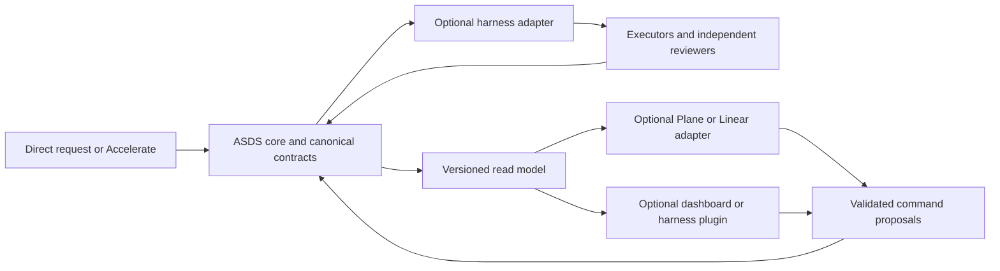

# Two-phase evolution: core first, optional integrations second

## Phase 1 — portable ASDS coordination

The implemented local protocol combines canonical task DAGs, independent dimensions
of classification, configurable role pairs, ready-wave selection, active resource
reservations, clean review packets, finite root dispositions and replayable state.
It retains activation/refusal behavior, one OpenSpec planning home, Accelerate v1
intake and existing evidence validators. See [orchestration](orchestration.md).

This phase is usable through a toolkit CLI/library and a host coordinator. It is
not a daemon, model router, installed spawn hook, distributed scheduler or remote
tracker connector. Model/profile availability is supplied by the actual harness.
Local deterministic tests do not qualify provider behavior or reviewer honesty.

## Phase 2 — optional execution and visual ecosystem (designed, not implemented)

The goal is a complete view of intent → decisions → specs → tasks → execution →
review → integration → evidence, while keeping each adapter replaceable. Three
extension boundaries serve different purposes:

| Adapter | Responsibility | Boundary it must preserve |
| --- | --- | --- |
| Harness | Observe capabilities, create bounded sessions, deliver packets, report identity/stop/evidence | Never infer availability from a configured model name or grant user permissions |
| Task/issue system | Map external items, owners, relations and status; project ASDS blockers and propose changes | External Done, closed issue or checkbox does not constitute ASDS acceptance |
| Visual client | Show DAG, ready waves, blockers/owners, resources, candidates, reviews and residuals | Display and command requests consume the same contract; no private state machine |

Plane and Linear are possible tracker adapters, not mandatory dependencies. A
third-party visual plugin, including one embedded in a DeepSeek-oriented harness,
should work through the same versioned boundary without forking the core. This is
an extensibility target, not a current compatibility claim for those products.

### Contract direction

The phase-1 JSON plan/journal/packet and replay functions are the local substrate.
Before network connectors, freeze a public integration v1 schema and conformance
suite. Do not expose the full journal to remote systems by default; it can contain
source bodies, internal references and authorization context.

Read model: protocol version, project/change/task stable identity, plan revision,
sequence, explicit lifecycle state, dependencies, blocker owner/reason, role
assignments, declared reservations, candidate/integration identities, evidence
references, last disposition and limitations. Include freshness/cursor metadata;
never show a disconnected or stale view as current. Numbered task labels remain
presentation; mapping uses stable scoped identity.

Command proposal envelope: adapter identity/version, idempotency key, project and
change identity, expected sequence and plan revision, requested operation, task
identity, actor provenance and supporting references. The coordinator authenticates
the actor and checks current permission, scope and transition before appending an
event. A command acknowledgement means received/accepted/rejected, never completed.
Arbitrary shell commands, model credentials and direct receipt edits are excluded.

Manifest: adapter id/version, supported protocol range, capabilities (read-only,
propose-task-change, report-worker, project-status), required permissions and data
exposure. Negotiate capabilities explicitly; unsupported versions fail visibly.
A view-only plugin gets no execution capability. Host adapters can report facts;
only the coordinator can reconcile them into acceptance. A local executable plugin
is not sandboxed simply because it has a manifest.

### Tracker synchronization rules

- Keep an explicit `(project, change, task ID) ↔ (provider, workspace, issue ID)`
  mapping, separate from human labels. Do not deduplicate by title.
- ASDS owns contract readiness, dependency acceptance, candidate/evidence and root
  disposition. Tracker assignments/priorities may be authoritative only under an
  explicit project policy. External blockers can add a hold, never erase an ASDS
  blocker. Remote graph edits are proposals requiring graph/revision validation.
- Use an outbox/inbox, idempotent operations, replay cursors, retry limits and
  conflict records. Reordered/duplicate webhooks, rate limits and partial writes
  must not duplicate work or silently overwrite a newer plan.
- Deleted/archived external items do not delete local evidence. Reopened issues
  propose reassessment; they do not rewrite past acceptance. Preserve cancellations
  and unmapped states explicitly, not under a generic Done column.
- Test offline work and reconnect reconciliation. Removing an adapter leaves the
  local lifecycle operable and historical links intelligible.

### Visual product scope

A useful ASDS cockpit needs more than a task checkbox board: multi-project/change
navigation; generated causal DAG; ready versus blocked explanation; owners and
active resource conflicts; role/profile selection and actual host identity; frozen
candidate and integrated evidence; findings/rework; root disposition; replay and
unproven boundaries. Separate artifact readiness from execution readiness and
completion. Provide accessible list/table alternatives to the DAG.

Start with read-only views. Add mutations through command proposals after their
conformance tests pass. A standalone dashboard may be a separate repository; an
embedded harness view should not need its server or frontend framework. The core
must not import React, Svelte, Rust services or vendor-specific tracker SDKs.

### Comparison of the two suggested projects

Inspected on 2026-10-02 through their upstream READMEs and package manifests.
This is documentary comparison, not a source security audit or runtime pilot.

| Reference | Useful starting point | ASDS adaptation still needed |
| --- | --- | --- |
| [oioi555/openspec-webui](https://github.com/oioi555/openspec-webui) | Multi-project artifact browsing, search, validation results, live updates, tool-aware suggested commands, Portuguese UI; Node/TypeScript with Svelte/Fastify | Task-level causal graph, journal state, independent review and forensic acceptance; tool suggestions must preserve ASDS authorization and host selection |
| [ToruAI/openspec-ui](https://github.com/ToruAI/openspec-ui) | Multi-repository kanban, artifact readiness, mobile view and SSE; React with Rust/Axum | Its documented spec-driven artifact chain and OpenSpec 1.6 compatibility are not proof of the ASDS custom schema or pinned 1.14 behavior; adapter must distinguish artifacts from tasks |

Sources: [WebUI README](https://raw.githubusercontent.com/oioi555/openspec-webui/main/README.md),
[WebUI package](https://raw.githubusercontent.com/oioi555/openspec-webui/main/package.json),
[UI README](https://raw.githubusercontent.com/ToruAI/openspec-ui/main/README.md),
[UI package](https://raw.githubusercontent.com/ToruAI/openspec-ui/main/package.json).
Both document MIT licensing; any fork must preserve notices and inspect dependency
licenses. The second describes specs as read-only while also offering idea capture;
that wording does not establish absence of all writes.

Recommendation: use WebUI as the initial functional benchmark for artifact
inspection and validation, and UI as the benchmark for portfolio/kanban visibility.
Do not select a fork just from screenshots or README feature counts. First qualify
schema support, source structure, mutation surfaces, maintenance cost, extension
seams and the exact licensed revision. An adapter or upstream contribution may be
smaller and easier to maintain than a fork. No clone or installation is necessary
to define the integration contract.

### Delivery order and exit criteria

1. Freeze integration DTOs and ownership rules with a fake adapter. Prove stale
   revision rejection, no permission creation and no remote-Done acceptance.
2. Build a read-only reference view against the same fixtures. Compare both UI
   candidates using the criteria above; decide reuse, contribution or a separate
   project with a bounded maintenance budget.
3. Implement one selected tracker adapter, initially projection-only; then enable
   approved incoming proposals. Qualify duplicates, races, disconnect, deletion,
   cancellation, drift and revocation with a test workspace and explicit authority.
4. Implement a host adapter or embedded visual plugin without coupling core policy
   to vendor models. Prove actual session/model identity, clean context, resource
   release and restart behavior on the selected supported harness.
5. Publish schemas, adapter examples and a conformance suite. Prove ASDS works with
   no adapter, each adapter independently, and two adapters together without double
   dispatch or conflicting status authority.

Phase 2 is complete only when these behaviors are demonstrated on selected real
integrations. No claim of universal compatibility or absence of all gaps follows
from the phase-1 unit suite. Hosting, credentials, installations and publication
retain the owner's existing explicit authorization and installation policies.
